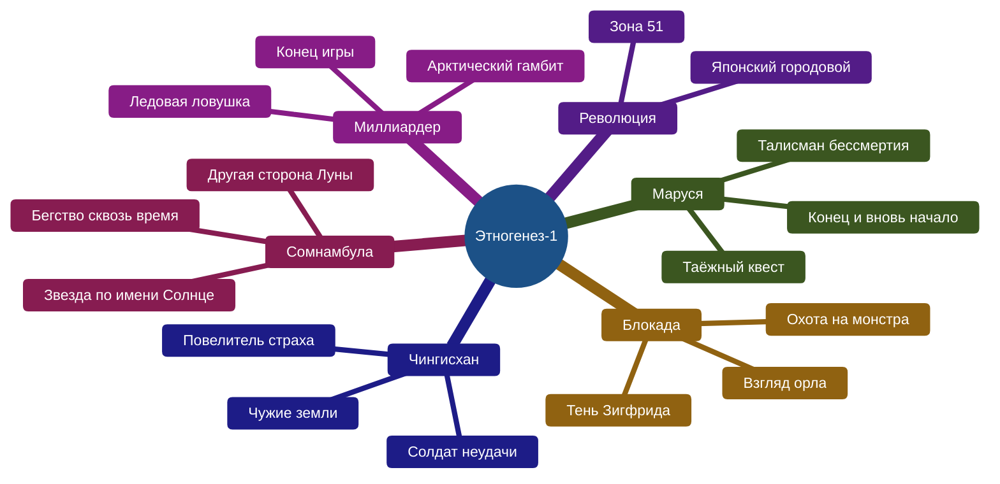
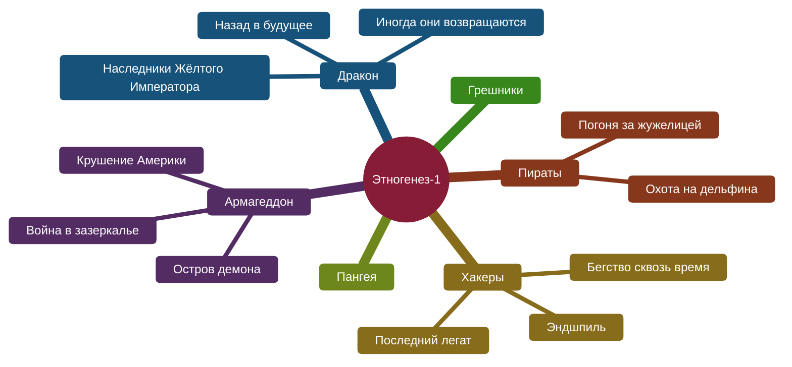
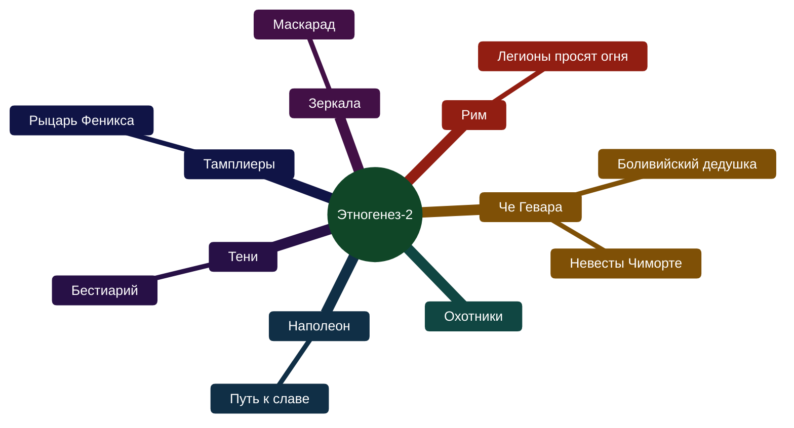
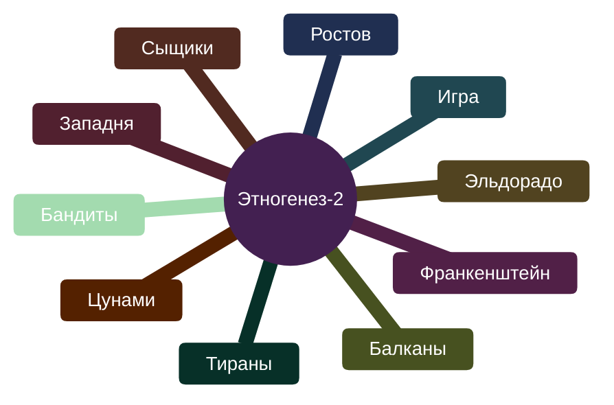
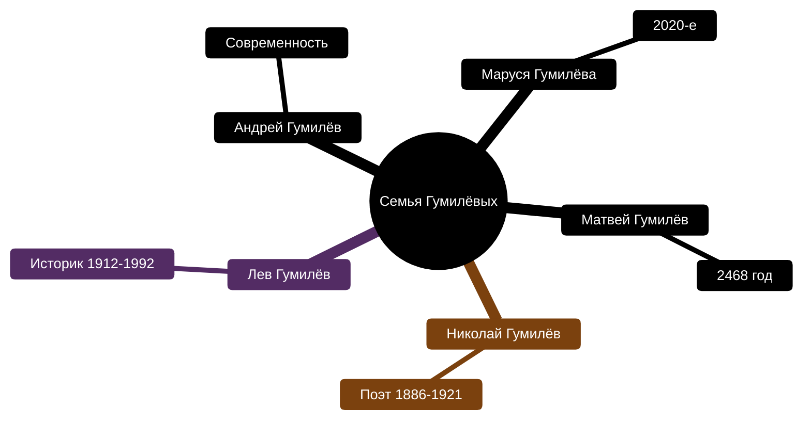
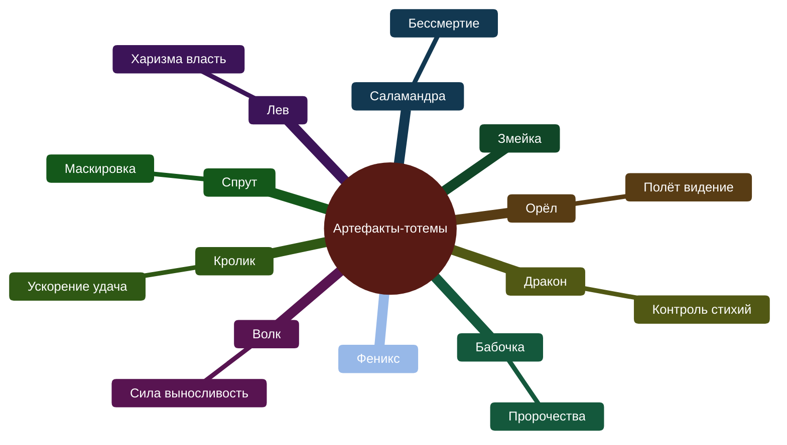
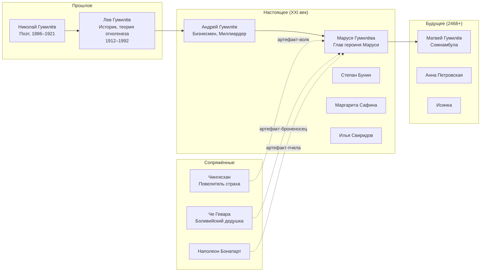
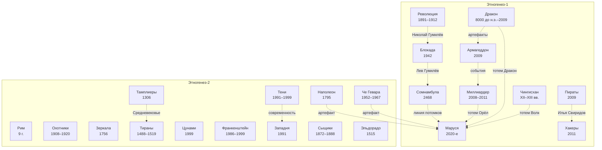

# Этногенез — полная карта серии

## Что это за проект

**«Этногенез»** — масштабный межавторский литературный сериал (2008–2015+), изданный издательством АСТ. Идея — показать сквозь историю семьи **Гумилёвых** (от поэта Николая Гумилёва до его вымышленных потомков) альтернативную историю Земли с элементами фантастики: артефакты-«тотемы» дают сверхспособности, инопланетное происхождение человечества и загадки, которые решаются на протяжении миллионов лет.

Ключевое: книги **читаются как отдельные романы**, но переплетаются сквозными персонажами, артефактами и хронологией. Каждая серия (подцикл) — 3 книги.

---

## Полная структура проекта

### Этногенез-1: 12 подциклов (36 книг)

Изначальный замысел — 12 серий по 3 книги. Всё построено вокруг **линии Гумилёва**: от древности до 2020-х годов.

| Серия | Книга 1 | Книга 2 | Книга 3 | Автор(ы) |
|:------|:--------|:--------|:--------|:---------|
| **Маруся** | Талисман бессмертия (2009) | Таёжный квест (2009) | Конец и вновь начало (2010) | П. Волошина, Е. Кульков / С. Волков / П. Волошина |
| **Блокада** | Охота на монстра (2009) | Взгляд орла (2009) | Тень Зигфрида (2009) | К. Бенедиктов |
| **Чингисхан** | Повелитель страха (2010) | Чужие земли (2010) | Солдат неудачи (2010) | С. Волков |
| **Революция** | Японский городовой (2009) | Зона 51 (2009) | *не издана* | Ю. Бурносов |
| **Миллиардер** | Ледовая ловушка (2010) | Арктический гамбит (2010) | Конец игры (2011) | Е. Кондратьева / К. Бенедиктов |
| **Сомнамбула** | Звезда по имени Солнце (2010) | Другая сторона Луны (2010) | Бегство сквозь время (2011) | А. Зорич / С. Волков |
| **Армагеддон** | Остров демона (2010) | Крушение Америки (2010) | Война в зазеркалье (2010) | И. Пронин / Ю. Бурносов / К. Бенедиктов |
| **Дракон** | Наследники Жёлтого Императора (2010) | Назад в будущее (2011) | Иногда они возвращаются (2011) | И. Алимов |
| **Пираты** | Погоня за жужелицей (2009) | Охота на дельфина (2011) | Пираты 3 | Л. Бортникова |
| **Хакеры** | Последний легат (2011) | Бегство сквозь время (2011) | Эндшпиль (2011) | Ш. Врочек / И. Пронин |
| **Пангея** | Конец и вновь начало | Другая сторона Луны | Зона 51 | П. Волошина |
| **Грешники** | *не издан* (автор выложил в интернет) | — | — | — |

### Этногенез-2: 17 подциклов (51+ книга)

Запущен летом 2011 года. Новые авторы, новые эпохи, но всё ещё в universe Гумилёвых.

| Серия | Книга 1 | Книга 2 | Книга 3 | Автор(ы) |
|:------|:--------|:--------|:--------|:---------|
| **Че Гевара** | Боливийский дедушка (2011) | Невесты Чиморте (2012) | — | К. Шаинян |
| **Рим** | Легионы просят огня | Рим-2 | — | Д. Овчинников |
| **Охотники** | Охотники-1 | Охотники-2 | — | — |
| **Наполеон** | Путь к славе (2012) | Наполеон-2 | — | И. Пронин |
| **Тамплиеры** | Рыцарь Феникса (2012) | Тамплиеры-2 | — | Ю. Сазонов |
| **Тени** | Бестиарий (2012) | Тени-2 | — | И. Наумов |
| **Зеркала** | Маскарад (2012) | Зеркала-2 | — | Д. Колодан |
| **Тираны** | Тираны-1 | Тираны-2 | — | — |
| **Цунами** | Цунами-1 | Цунами-2 | — | — |
| **Франкенштейн** | Франкенштейн-1 | Франкенштейн-2 | — | — |
| **Западня** | Западня-1 | Западня-2 | — | — |
| **Сыщики** | Сыщики-1 | Сыщики-2 | — | — |
| **Эльдорадо** | Эльдорадо-1 | Эльдорадо-2 | — | — |
| **Балканы** | — | — | — | — |
| **Бандиты** | — | — | — | — |
| **Игра** | — | — | — | — |
| **Ростов** | Ростов-1 | — | — | — |

---

## Диаграмма: полная карта проекта

### Этногенез-1: 12 серий





### Этногенез-2: 17 серий





### Семья Гумилёвых и артефакты





---

## Хронология событий в книгах

### Древность

| Год | Серия | Книга | Автор |
|:----|:------|:------|:------|
| ~8000 до н.э. | 🟠 **Дракон** | Наследники Жёлтого Императора | И. Алимов |
| 200 до н.э. | 🟠 **Дракон** | Назад в будущее | И. Алимов |
| XII–XIII вв. | 🟠 **Чингисхан** | Повелитель страха / Чужие земли / Солдат неудачи | С. Волков |

### Средневековье

| Год | Серия | Книга | Автор |
|:----|:------|:------|:------|
| 9 г. н.э. | 🟣 **Рим** | Легионы просят огня | Д. Овчинников |
| 1306 | 🟣 **Тамплиеры** | Рыцарь Феникса | Ю. Сазонов |
| 1488–1519 | 🟣 **Тираны** | Тираны | И. Наумов |
| 1515 | 🟣 **Эльдорадо** | Эльдорадо | Ю. Бурносов |

### XVIII – начало XX века

| Год | Серия | Книга | Автор |
|:----|:------|:------|:------|
| 1756 | 🟢 **Зеркала** | Маскарад | Д. Колодан |
| 1788–1797 | 🟢 **Наполеон** | Путь к славе | И. Пронин |
| 1891–1912 | 🟢 **Революция** | Японский городовой / Зона 51 | Ю. Бурносов |
| 1908–1920 | 🟢 **Охотники** | Охотники | — |
| 1919–1921 | 🟢 **Бандиты** | Бандиты | — |

### XX век

| Год | Серия | Книга | Автор |
|:----|:------|:------|:------|
| 1942 | 🔴 **Блокада** | Охота на монстра / Взгляд орла / Тень Зигфрида | К. Бенедиктов |
| 1952–1967 | 🔴 **Че Гевара** | Боливийский дедушка / Невесты Чиморте | К. Шаинян |
| 1986–1999 | 🔴 **Франкенштейн** | Франкенштейн | И. Пронин |
| 1991 | 🔴 **Западня** | Западня | — |
| 1991–1999 | 🔴 **Тени** | Бестиарий | И. Наумов |
| 1999 | 🔴 **Цунами** | Цунами | — |

### Современность

| Год | Серия | Книга | Автор |
|:----|:------|:------|:------|
| 2008–2011 | 🔵 **Миллиардер** | Ледовая ловушка / Арктический гамбит / Конец игры | Е. Кондратьева / К. Бенедиктов |
| 2009 | 🔵 **Пираты** | Погоня за жужелицей / Охота на дельфина | Л. Бортникова |
| 2009 | 🔵 **Армагеддон** | Остров демона / Крушение Америки / Война в зазеркалье | И. Пронин / Ю. Бурносов / К. Бенедиктов |
| 2010 | 🔵 **Дракон** | Иногда они возвращаются | И. Алимов |
| 2011 | 🔵 **Хакеры** | Последний легат / Бегство сквозь время / Эндшпиль | Ш. Врочек / И. Пронин |
| 2011 | 🔵 **Игра** | Игра | — |
| 2012 | 🔵 **Ростов** | Ростов | — |

### Будущее

| Год | Серия | Книга | Автор |
|:----|:------|:------|:------|
| 2020-е | 🩷 **Маруся** | Талисман бессмертия / Таёжный квест / Конец и вновь начало | П. Волошина |
| 2468 | 🩷 **Сомнамбула** | Звезда по имени Солнце / Другая сторона Луны / Бегство сквозь время | А. Зорич / С. Волков |

---

## Главные персонажи — линия Гумилёва



---

## Механика вселенной

### Артефакты-тотемы

Каждый носитель получает **тотем** — артефакт, дающий сверхспособность. Тотемы связаны с образом животного/существа.

| Тотем | Способность | Кто носит |
|:------|:-----------|:----------|
| 🐉 **Дракон** | Контроль стихий | Константин Чижиков (Дракон) |
| 🦅 **Орёл** | Полёт, видение | Андрей Гумилёв (Миллиардер) |
| 🐺 **Волк** | Сила, выносливость | Артём Новиков (Чингисхан) |
| 🦎 **Саламандра** | Бессмертие (возрождение) | Маруся Гумилёва |
| 🐇 **Кролик** | Ускорение, удача | Степан Бунин |
| 🦑 **Спрут** | Маскировка | Илья Свиридов |
| 🦋 **Бабочка** | Пророчества | — |
| 🦁 **Лев** | Харизма, власть | Матвей Гумилёв (Сомнамбула) |
| 🐝 **Пчела** | Организация, связь | Наполеон |
| 🐒 **Обезьяна** | Адаптивность | Че Гевара |
| 🐢 **Черепаха** | Долговечность | Дракон Кн.2 |

### Ключевые концепты

- **Этногенез** — теория Льва Гумилёва о рождении народов; в проекте — буквальное «рождение» нового вида людей через артефакты
- **Розовые звёзды** — инопланетная раса, создавшая артефакты
- **Тотемы** — связь между древними и потомками Гумилёва
- **Хроноклуб** — организация, контролирующая время

---

## Связи между сериями



---

## Что ты уже прочитал

### Точно читал

| Серия | Книги | Статус |
|:------|:------|:-------|
| **Маруся** | [[Маруся — Талисман бессмертия\|1. Талисман бессмертия]] · [[Маруся — Таёжный квест\|2. Таёжный квест]] · [[Маруся — Конец и вновь начало\|3. Конец и вновь начало]] | прочитал часть, не помню сколько |
| **Хакеры** | [[Хакеры — Последний легат\|1. Последний легат]] · [[Хакеры — Бегство сквозь время\|2. Бегство сквозь время]] · [[Хакеры — Эндшпиль\|3. Эндшпиль]] | прочитал часть, не помню сколько |

### Может быть читал

| Серия | Книги | Статус |
|:------|:------|:-------|
| **Миллиардер** | [[Миллиардер — Ледовая ловушка\|1. Ледовая ловушка]] · [[Миллиардер — Арктический гамбит\|2. Арктический гамбит]] · [[Миллиардер — Конец игры\|3. Конец игры]] | вроде бы читал, не уверен |

### Как вспомнить, сколько прочитал

- Посмотри на полках — **обложки**, которые узнаёшь
- Проверь **электронную библиотеку** (ЛитРес, Bookmate, Яндекс.Книги)
- Если вспомнишь **концовку** какой-то книги — значит, её дочитал

---

## С чего начать читать

Рекомендуемый порядок чтения серий. Все книги внутри серии читаются подряд. Порядок серий выстроен так, чтобы пазл складывался постепенно — от флагмана к корням, через эпохи, к финалу в будущем.

### Фаза 1: Основа

| # | Серия | Почему здесь |
|---|-------|--------------|
| 1 | **Маруся** | Флагман проекта. Современность (2020-е). Знакомство с артефактами-тотемами, семьёй Гумилёвых, Марусей и Степаном. Самый доступный вход. Без этого цикла остальное не сложится. |
| 2 | **Блокада** | Ленинград 1942, Лев Гумилёв. Лучшая проза проекта (К. Бенедиктов). Раскрывает, кто такой Лев Гумилёв и как артефакты связаны с историей. |
| 3 | **Чингисхан** | XII–XIII вв., Монголия. Тотем Волк, первые артефакты в действии. Понимаем, что тотемы существовали тысячи лет. Самый «мужской» цикл. |

**Итог фазы:** читатель понимает что такое тотемы, кто Гумилёвы, как артефакты связаны с историей.

### Фаза 2: Расширение

| # | Серия | Почему здесь |
|---|-------|--------------|
| 4 | **Дракон** | 8000 до н.э. → современность. Самый масштабный по охвату. Связывает прошлое с настоящим, отвечает на вопросы из «Чингисхана». |
| 5 | **Миллиардер** | Современность, Арктика. Тотем Орёл, бизнес + интриги. Параллельная линия с «Марусей» — другой угол зрения. |
| 6 | **Хакеры** | Современность, киберпанк. Другой тон — более лёгкий, с юмором, но с серьёзными темами. |

**Итог фазы:** читатель видит, как разные эпохи и стили связаны.

### Фаза 3: Исторические трилогии

| # | Серия | Почему здесь |
|---|-------|--------------|
| 7 | **Революция** | Конец XIX — начало XX вв., Россия/Япония. Мост между историей и современностью. |
| 8 | **Охотники** | Эпоха революций 1908–1920. Продолжает тему «Революции». |
| 9 | **Бандиты** | Гражданская война. Завершает революционную трилогию. |

**Трилогия** читается подряд как единая история.

### Фаза 4: Европа и Америка

| # | Серия | Почему здесь |
|---|-------|--------------|
| 10 | **Рим** | Древний Рим, 9 г. н.э. Самая короткая серия — хороший перекус. |
| 11 | **Тамплиеры** | Средневековье, орден тамплиеров. Мистика + история. |
| 12 | **Тираны** | Эпоха Возрождения, Борджиа. Интриги, власть, искусство. |
| 13 | **Эльдорадо** | Конкистадоры, Новый Свет. Приключения. |
| 14 | **Зеркала** | Венеция XVIII века. Маскарады и тайны. |
| 15 | **Наполеон** | Путь Наполеона от корсиканца до императора. |
| 16 | **Че Гевара** | Латинская Америка, революция. Тотем Обезьяна. |

### Фаза 5: XX–XXI век

| # | Серия | Почему здесь |
|---|-------|--------------|
| 17 | **Армагеддон** | Современность, постапокалиптика. Крушение Америки, Зона 51. |
| 18 | **Пираты** | Карибское море, приключения. Самая «летняя» серия — отдых от драмы. |
| 19 | **Франкенштейн** | Научные эксперименты, 1986–1999. Границы науки и этики. |
| 20 | **Тени** | Современность, мистика. Бестиарий, тайны. |
| 21 | **Цунами** | Конец XX века, стихийные бедствия. |
| 22 | **Западня** | Распад СССР, 1991. Ловушка перемен. |
| 23 | **Сыщики** | Детектив, 1872–1888. Исторический криминал. |

### Фаза 6: Финал

| # | Серия | Почему здесь |
|---|-------|--------------|
| 24 | **Сомнамбула** | 2468 год, Марс. Финальная точка — здесь всё сходится. Без предыдущих серий не будет того же впечатления. |
| 25 | **Игра** | Современность, финал Этногенеза-1. |
| 26 | **Ростов** | Современность, эпилог. |

### Полная последовательность

```
Маруся → Блокада → Чингисхан → Дракон → Миллиардер → Хакеры
→ Революция → Охотники → Бандиты
→ Рим → Тамплиеры → Тираны → Эльдорадо → Зеркала → Наполеон → Че Гевара
→ Армагеддон → Пираты → Франкенштейн → Тени → Цунами → Западня → Сыщики
→ Сомнамбула → Игра → Ростов
```

### Одна книга для пробы

Если хочешь понять, подходит ли проект — бери **«Блокада. Кн. 1. Охота на монстра»** или **«Чингисхан. Кн. 1. Повелитель страха»**.

---

## Ссылки

- [http://www.etnogenez.ru/](http://www.etnogenez.ru/) — официальный сайт проекта
- [Wikipedia: Этногенез (литературный проект)](https://ru.wikipedia.org/wiki/Этногенез_(литературный_проект))
- [Bigenc.ru: Этногенез (межавторский проект)](https://bigenc.ru/c/etnogenez-mezhavtorskii-proekt-ae90b6)
- [[Главная|← К прочитанным книгам]]
