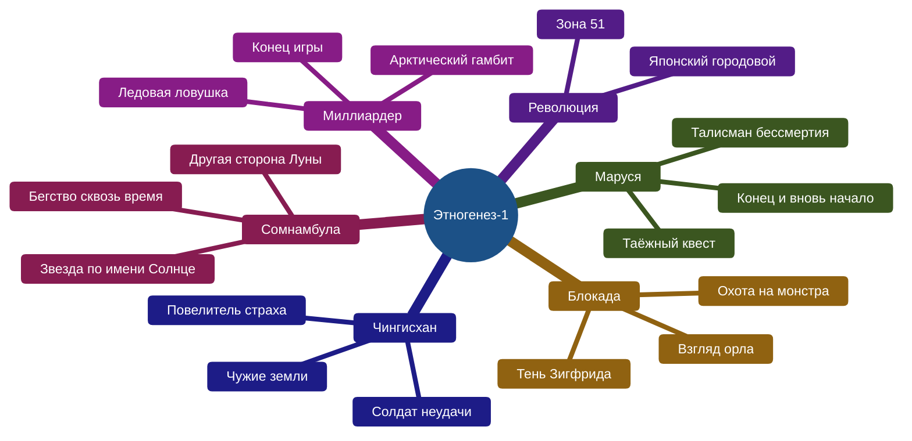
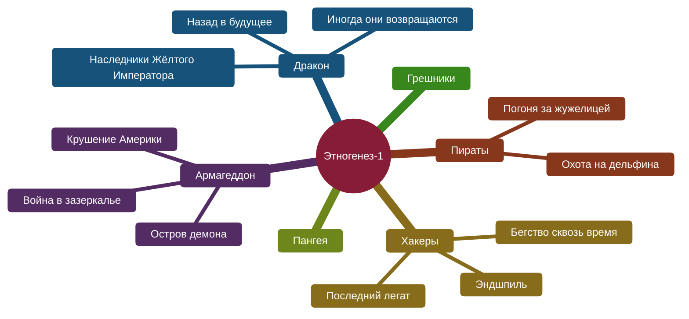
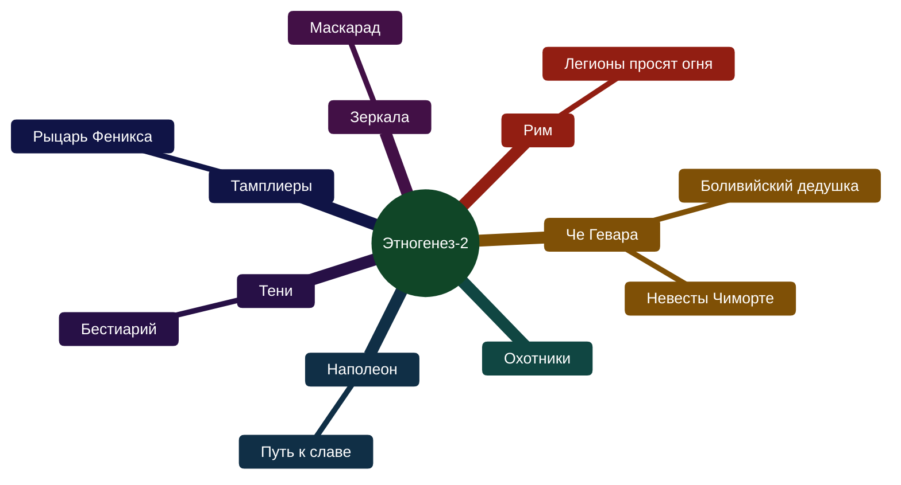
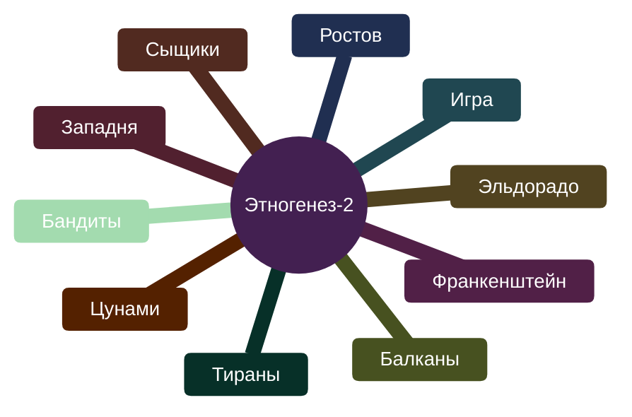
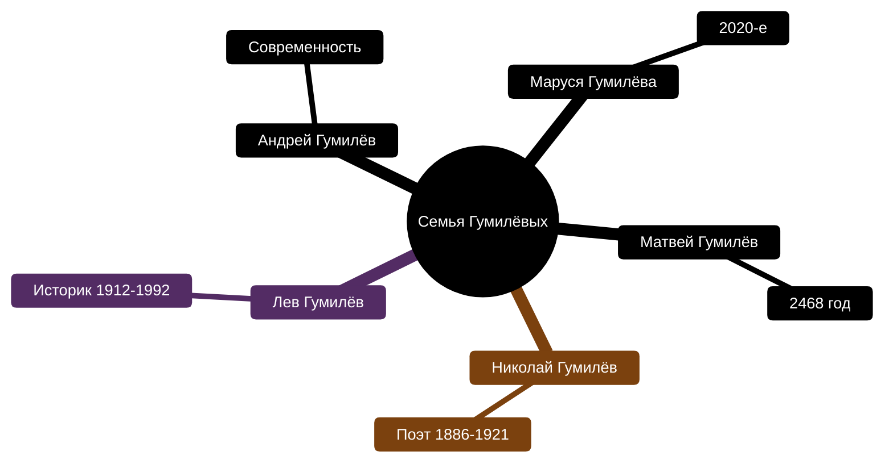
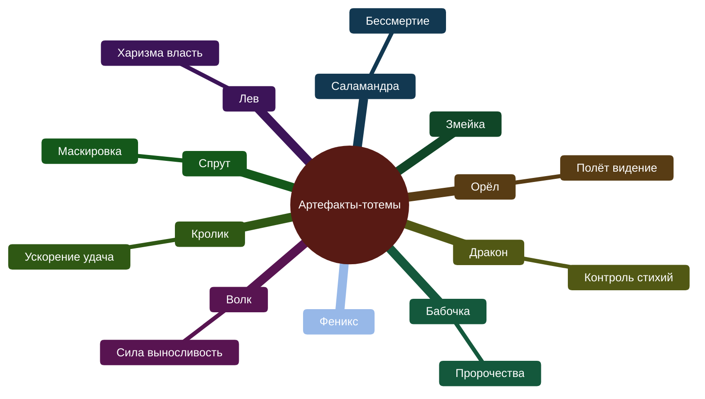
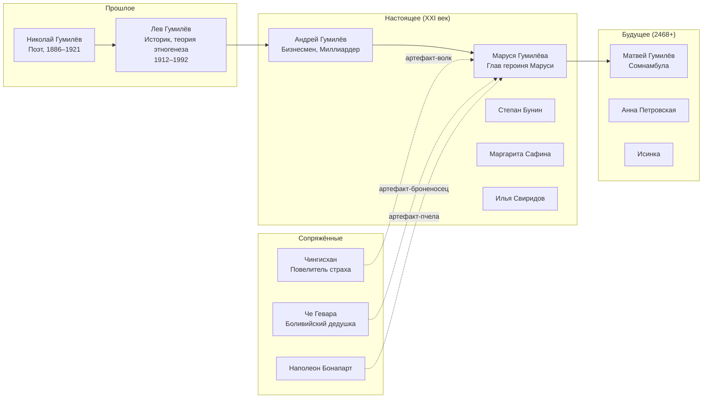
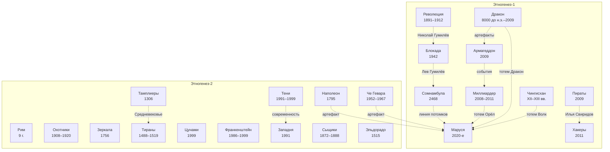

# Этногенез — полная карта серии

## Что это за проект

**«Этногенез»** — масштабный межавторский литературный сериал (2008–2015+), изданный издательством АСТ. Идея — показать сквозь историю семьи **Гумилёвых** (от поэта Николая Гумилёва до его вымышленных потомков) альтернативную историю Земли с элементами фантастики: артефакты-«тотемы» дают сверхспособности, инопланетное происхождение человечества и загадки, которые решаются на протяжении миллионов лет.

Ключевое: книги **читаются как отдельные романы**, но переплетаются сквозными персонажами, артефактами и хронологией. Каждая серия (подцикл) — 3 книги.

---

## Полная структура проекта

### Этногенез-1: 12 подциклов (36 книг)

Изначальный замысел — 12 серий по 3 книги. Всё построено вокруг **линии Гумилёва**: от древности до 2020-х годов.

| Серия | Книга 1 | Книга 2 | Книга 3 | Автор(ы) |
|:------|:--------|:--------|:--------|:---------|
| **Маруся** | Талисман бессмертия (2009) | Таёжный квест (2009) | Конец и вновь начало (2010) | П. Волошина, Е. Кульков / С. Волков / П. Волошина |
| **Блокада** | Охота на монстра (2009) | Взгляд орла (2009) | Тень Зигфрида (2009) | К. Бенедиктов |
| **Чингисхан** | Повелитель страха (2010) | Чужие земли (2010) | Солдат неудачи (2010) | С. Волков |
| **Революция** | Японский городовой (2009) | Зона 51 (2009) | *не издана* | Ю. Бурносов |
| **Миллиардер** | Ледовая ловушка (2010) | Арктический гамбит (2010) | Конец игры (2011) | Е. Кондратьева / К. Бенедиктов |
| **Сомнамбула** | Звезда по имени Солнце (2010) | Другая сторона Луны (2010) | Бегство сквозь время (2011) | А. Зорич / С. Волков |
| **Армагеддон** | Остров демона (2010) | Крушение Америки (2010) | Война в зазеркалье (2010) | И. Пронин / Ю. Бурносов / К. Бенедиктов |
| **Дракон** | Наследники Жёлтого Императора (2010) | Назад в будущее (2011) | Иногда они возвращаются (2011) | И. Алимов |
| **Пираты** | Погоня за жужелицей (2009) | Охота на дельфина (2011) | Пираты 3 | Л. Бортникова |
| **Хакеры** | Последний легат (2011) | Бегство сквозь время (2011) | Эндшпиль (2011) | Ш. Врочек / И. Пронин |
| **Пангея** | Конец и вновь начало | Другая сторона Луны | Зона 51 | П. Волошина |
| **Грешники** | *не издан* (автор выложил в интернет) | — | — | — |

### Этногенез-2: 17 подциклов (51+ книга)

Запущен летом 2011 года. Новые авторы, новые эпохи, но всё ещё в universe Гумилёвых.

| Серия | Книга 1 | Книга 2 | Книга 3 | Автор(ы) |
|:------|:--------|:--------|:--------|:---------|
| **Че Гевара** | Боливийский дедушка (2011) | Невесты Чиморте (2012) | — | К. Шаинян |
| **Рим** | Легионы просят огня | Рим-2 | — | Д. Овчинников |
| **Охотники** | Охотники-1 | Охотники-2 | — | — |
| **Наполеон** | Путь к славе (2012) | Наполеон-2 | — | И. Пронин |
| **Тамплиеры** | Рыцарь Феникса (2012) | Тамплиеры-2 | — | Ю. Сазонов |
| **Тени** | Бестиарий (2012) | Тени-2 | — | И. Наумов |
| **Зеркала** | Маскарад (2012) | Зеркала-2 | — | Д. Колодан |
| **Тираны** | Тираны-1 | Тираны-2 | — | — |
| **Цунами** | Цунами-1 | Цунами-2 | — | — |
| **Франкенштейн** | Франкенштейн-1 | Франкенштейн-2 | — | — |
| **Западня** | Западня-1 | Западня-2 | — | — |
| **Сыщики** | Сыщики-1 | Сыщики-2 | — | — |
| **Эльдорадо** | Эльдорадо-1 | Эльдорадо-2 | — | — |
| **Балканы** | — | — | — | — |
| **Бандиты** | — | — | — | — |
| **Игра** | — | — | — | — |
| **Ростов** | Ростов-1 | — | — | — |

---

## Диаграмма: полная карта проекта

### Этногенез-1: 12 серий

### Этногенез-2: 17 серий

### Семья Гумилёвых и артефакты

---

## Хронология событий в книгах

> [!info] Интерактивная шкала времени
> Откройте [[Этногенез — хронология.html]] для полноценной горизонтальной шкалы времени с прокруткой, подсказками и навигацией.

```mermaid
gantt
    title Хронология Этногенеза — от древности до будущего
    dateFormat X
    axisFormat %s г.

    section Древность
        Дракон — тотемы (8000 до н.э.)       :done, d1, 8000, 100
        Чингисхан — монголы (XII–XIII вв.)   :done, d2, 1200, 100

    section Средневековье
        Рим — легионы (9 г.)                  :done, r1, 9, 50
        Тамплиеры (1306)                      :done, t1, 1306, 30
        Тираны — Возрождение (1488–1519)      :done, ty1, 1488, 31
        Эльдорадо — конкистадоры (1515)       :done, el1, 1515, 10

    section Новое время
        Зеркала — Венеция (1756)              :done, z1, 1756, 10
        Наполеон — путь к славе (1788–1797)   :done, n1, 1788, 9
        Революция — Россия/Япония (1891–1912) :done, rv1, 1891, 21
        Охотники — революция (1908–1920)      :done, oh1, 1908, 12
        Бандиты (1919–1921)                   :done, ba1, 1919, 2

    section XX век
        Блокада — Ленинград (1942)            :done, b1, 1942, 1
        Че Гевара — Лат. Америка (1952–1967)  :done, cg1, 1952, 15
        Франкенштейн (1986–1999)              :done, fr1, 1986, 13
        Западня — распад СССР (1991)          :done, zp1, 1991, 1
        Тени — современность (1991–1999)      :done, tn1, 1991, 9
        Цунами (1999)                         :done, ts1, 1999, 1

    section Современность
        Миллиардер — Арктика (2008–2011)      :done, ml1, 2008, 4
        Пираты, Хакеры, Армагеддон (2009)     :done, ph1, 2009, 3
        Дракон — Петербург/Китай (2010)       :done, dk1, 2010, 2
        Игра / Ростов (2011–2012)             :done, ig1, 2011, 2

    section Будущее
        Маруся — Москва/Шанхай (2020-е)       :crit, ms1, 2020, 5
        Сомнамбула — Марс (2468)              :crit, sn1, 2468, 5
```

---

## Главные персонажи — линия Гумилёва

---

## Механика вселенной

### Артефакты-тотемы

Каждый носитель получает **тотем** — артефакт, дающий сверхспособность. Тотемы связаны с образом животного/существа.

| Тотем | Способность | Кто носит |
|:------|:-----------|:----------|
| 🐉 **Дракон** | Контроль стихий | Константин Чижиков (Дракон) |
| 🦅 **Орёл** | Полёт, видение | Андрей Гумилёв (Миллиардер) |
| 🐺 **Волк** | Сила, выносливость | Артём Новиков (Чингисхан) |
| 🦎 **Саламандра** | Бессмертие (возрождение) | Маруся Гумилёва |
| 🐇 **Кролик** | Ускорение, удача | Степан Бунин |
| 🦑 **Спрут** | Маскировка | Илья Свиридов |
| 🦋 **Бабочка** | Пророчества | — |
| 🦁 **Лев** | Харизма, власть | Матвей Гумилёв (Сомнамбула) |
| 🐝 **Пчела** | Организация, связь | Наполеон |
| 🐒 **Обезьяна** | Адаптивность | Че Гевара |
| 🐢 **Черепаха** | Долговечность | Дракон Кн.2 |

### Ключевые концепты

- **Этногенез** — теория Льва Гумилёва о рождении народов; в проекте — буквальное «рождение» нового вида людей через артефакты
- **Розовые звёзды** — инопланетная раса, создавшая артефакты
- **Тотемы** — связь между древними и потомками Гумилёва
- **Хроноклуб** — организация, контролирующая время

---

## Связи между сериями

---

## Что ты уже прочитал

### Точно читал

| Серия | Книги | Статус |
|:------|:------|:-------|
| **Маруся** | [[Маруся — Талисман бессмертия\|1. Талисман бессмертия]] · [[Маруся — Таёжный квест\|2. Таёжный квест]] · [[Маруся — Конец и вновь начало\|3. Конец и вновь начало]] | прочитал часть, не помню сколько |
| **Хакеры** | [[Хакеры — Последний легат\|1. Последний легат]] · [[Хакеры — Бегство сквозь время\|2. Бегство сквозь время]] · [[Хакеры — Эндшпиль\|3. Эндшпиль]] | прочитал часть, не помню сколько |

### Может быть читал

| Серия | Книги | Статус |
|:------|:------|:-------|
| **Миллиардер** | [[Миллиардер — Ледовая ловушка\|1. Ледовая ловушка]] · [[Миллиардер — Арктический гамбит\|2. Арктический гамбит]] · [[Миллиардер — Конец игры\|3. Конец игры]] | вроде бы читал, не уверен |

### Как вспомнить, сколько прочитал

- Посмотри на полках — **обложки**, которые узнаёшь
- Проверь **электронную библиотеку** (ЛитРес, Bookmate, Яндекс.Книги)
- Если вспомнишь **концовку** какой-то книги — значит, её дочитал

---

## С чего начать читать

Если хочешь **войти в серию заново**, рекомендую порядок:

1. **Маруся** (Волошина) — отправная точка, современность, 2020-е. Знакомство с Марусей, Степаном, артефактами.
2. **Блокада** (Бенедиктов) — Ленинград 1942, Лев Гумилёв. Лучшая проза проекта.
3. **Чингисхан** (Волков) — XII–XIII вв. + Афганистан. Самый «мужской» цикл.
4. **Миллиардер** (Кондратьева / Бенедиктов) — современность, бизнес + Арктика.
5. **Сомнамбула** (Зорич) — космос, 2468 год. Самый масштабный по охвату.

Если хочешь **одну книгу для пробы** — бери **«Блокада. Кн. 1. Охота на монстра»** или **«Чингисхан. Кн. 1. Повелитель страха»**.

---

## Ссылки

- [http://www.etnogenez.ru/](http://www.etnogenez.ru/) — официальный сайт проекта
- [Wikipedia: Этногенез (литературный проект)](https://ru.wikipedia.org/wiki/Этногенез_(литературный_проект))
- [Bigenc.ru: Этногенез (межавторский проект)](https://bigenc.ru/c/etnogenez-mezhavtorskii-proekt-ae90b6)
- [[Главная|← К прочитанным книгам]]
